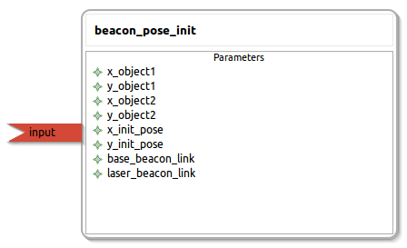

beacon_pose_init
====================

General description
---------------------
The beacon_pose_init package

Node: beacon_pose_init
---------------------
#### Parameters
**x_object1** *(double, default: 0.0)*
<!--- protected region x_object1 on begin -->
<!--- protected region x_object1 end -->

**y_object1** *(double, default: 0.4)*
<!--- protected region y_object1 on begin -->
<!--- protected region y_object1 end -->

**x_object2** *(double, default: 0.0)*
<!--- protected region x_object2 on begin -->
<!--- protected region x_object2 end -->

**y_object2** *(double, default: 1.6)*
<!--- protected region y_object2 on begin -->
<!--- protected region y_object2 end -->

**x_init_pose** *(double, default: 0.0)*
<!--- protected region x_init_pose on begin -->
<!--- protected region x_init_pose end -->

**y_init_pose** *(double, default: 0.0)*
<!--- protected region y_init_pose on begin -->
<!--- protected region y_init_pose end -->

**base_beacon_link** *(string, default: beacon_link)*
<!--- protected region base_beacon_link on begin -->
<!--- protected region base_beacon_link end -->

**laser_beacon_link** *(string, default: beacon_laser_link)*
<!--- protected region laser_beacon_link on begin -->
<!--- protected region laser_beacon_link end -->

#### Published Topics

#### Subscribed Topics
**input** *(sensor_msgs::PointCloud2)*   
<!--- protected region input on begin -->
<!--- protected region input end -->

