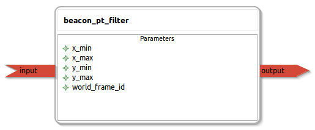

beacon_pt_filter
====================

General description
---------------------
The beacon_pt_filter package allow the user to make a PathThrough filter to the input LaserScan and transform it into a PointCloud

Node: beacon_pt_filter
---------------------
#### Parameters
**x_min** *(double, default: -1.5)*
<!--- protected region x_min on begin -->
<!--- protected region x_min end -->

**x_max** *(double, default: 1.5)*
<!--- protected region x_max on begin -->
<!--- protected region x_max end -->

**y_min** *(double, default: 0)*
<!--- protected region y_min on begin -->
<!--- protected region y_min end -->

**y_max** *(double, default: 2.0)*
<!--- protected region y_max on begin -->
<!--- protected region y_max end -->

**world_frame_id** *(string, default: world)*
<!--- protected region world_frame_id on begin -->
<!--- protected region world_frame_id end -->

#### Published Topics
**output** *(sensor_msgs::PointCloud2)*   
<!--- protected region output on begin -->
<!--- protected region output end -->

#### Subscribed Topics
**input** *(sensor_msgs::LaserScan)*   
<!--- protected region input on begin -->
<!--- protected region input end -->

