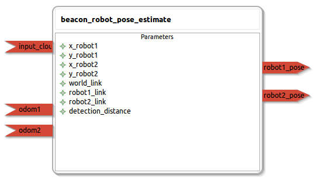

beacon_robot_pose_estimate
====================

General description
---------------------
The beacon_robot_pose_estimate package

Node: beacon_robot_pose_estimate
---------------------
#### Parameters
**x_robot1** *(double, default: 0.0)*
<!--- protected region x_robot1 on begin -->
<!--- protected region x_robot1 end -->

**y_robot1** *(double, default: 0.0)*
<!--- protected region y_robot1 on begin -->
<!--- protected region y_robot1 end -->

**x_robot2** *(double, default: 0.0)*
<!--- protected region x_robot2 on begin -->
<!--- protected region x_robot2 end -->

**y_robot2** *(double, default: 0.0)*
<!--- protected region y_robot2 on begin -->
<!--- protected region y_robot2 end -->

**world_link** *(string, default: world)*
<!--- protected region world_link on begin -->
<!--- protected region world_link end -->

**robot1_link** *(string, default: robot1_base_link)*
<!--- protected region robot1_link on begin -->
<!--- protected region robot1_link end -->

**robot2_link** *(string, default: robot2_base_link)*
<!--- protected region robot2_link on begin -->
<!--- protected region robot2_link end -->

**detection_distance** *(double, default: 0.07)*
<!--- protected region detection_distance on begin -->
<!--- protected region detection_distance end -->

#### Published Topics
**robot1_pose** *(geometry_msgs::Pose2D)*   
<!--- protected region robot1_pose on begin -->
The published position of the robot 1.
<!--- protected region robot1_pose end -->

**robot2_pose** *(geometry_msgs::Pose2D)*   
<!--- protected region robot2_pose on begin -->
The published position of the robot 2.
<!--- protected region robot2_pose end -->

#### Subscribed Topics
**input_cloud** *(sensor_msgs::PointCloud2)*   
<!--- protected region input_cloud on begin -->
The input PointCloud to find robots.
<!--- protected region input_cloud end -->

**odom1** *(nav_msgs::Odometry)*   
<!--- protected region odom1 on begin -->
<!--- protected region odom1 end -->

**odom2** *(nav_msgs::Odometry)*   
<!--- protected region odom2 on begin -->
<!--- protected region odom2 end -->

