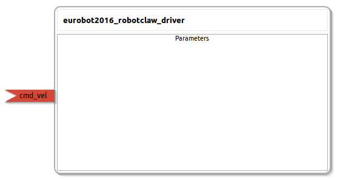

eurobot2016_robotclaw_driver
====================

General description
---------------------
The eurobot2016_robotclaw_driver package

Node: eurobot2016_robotclaw_driver
---------------------
#### Parameters

#### Published Topics

#### Subscribed Topics
**cmd_vel** *(geometry_msgs::Twist)*   
<!--- protected region cmd_vel on begin -->
<!--- protected region cmd_vel end -->

